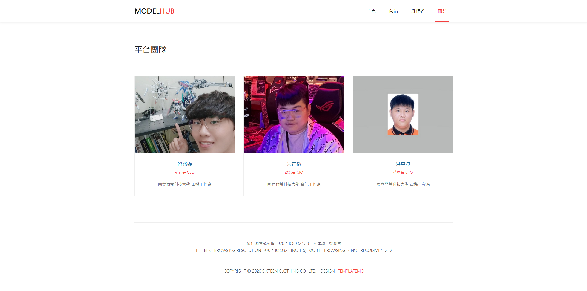

# 2024 地方創生創意會展行銷競賽 參賽作品

# MODELHUB
#### 專為模型者創造的商品和交友平台

- #### 團隊資訊

    - #### 團隊名稱：Raven’s 酒館

    - #### 作品名稱：MODELHUB

    - #### 作品動機  
    我們企業的核心使命是建立一個可靠的宣傳平台，專為個人創作者提供一個展現才華的機會。這個平台致力於提供安全、開放、並有力的宣傳環境，為創作者們打開更廣闊的曝光空間，並連結他們與潛在粉絲和支持者。
    >
    我們的主要目標是讓創作者能夠輕鬆地將他們的作品放上平台，並提供消費者依喜好選擇的機會。透過強大的展示功能，我們希望每位創作者都能夠被看見，使消費者能夠根據各自的喜好、價值觀和需求，做出有意義的選擇。
    >
    我們的創業動機來自於個人創作者在宣傳方面面臨的挑戰。很多優秀的創作者由於宣傳力不足，作品難以被廣泛發現。我們想要打造一個平台，讓創作者們能夠聚集、互相支持，並透過集體力量提高他們的曝光度。透過這個平台，我們希望激勵創作者們發揮創意，共同打造一個充滿活力的藝術和創作社群。我们的動機是為了促進創作者的成長和成功，讓他們的聲音被更多人聽到。

    - #### 團隊成員

- ## 範例資源
    - [影片檢視](https://youtu.be/MEwCE7QWyLg?si=JpRgLjSJ2lmBuYvj)
        - rel: [***https://youtu.be/MEwCE7QWyLg?si=JpRgLjSJ2lmBuYvj***](https://youtu.be/MEwCE7QWyLg?si=JpRgLjSJ2lmBuYvj)

---

## 目錄
- [目錄](#目錄)
- [開發環境](#開發環境)
- [如何執行](#如何執行)
- [版本差異](#版本差異)
- [日誌](#日誌)
- [貢獻](#貢獻)
- [著作權](#著作權)

---

## 開發環境

- Windows Home 10 64bit
- Chrome Version 114.0.5735.199 (Official Build) (64-bit)

---

## 如何執行

> 預設 ***Windows Home 10 64bit*** 作業系統  

- 方法一：直接點兩下執行 `index.html`

- 方法二：點擊[網頁連結](https://zongzong0408.github.io/MakerBar)，在網路公開觀看
    - rel: [***https://zongzong0408.github.io/MakerBar***](https://zongzong0408.github.io/MakerBar)

## 版本差異

| 版本 | 描述 |
| :--: | ---- |
| v1.0 | 現階段已完成。 |

## 日誌

| 時間 | 事件 |
| :--: | ---- |
| 2024/04/20 | 完成。 |

## 貢獻

此作品網頁部分為我全權處理，文書和報名資料皆其餘組員分配處理。
由於時間限制，網頁模板參考[***TemplateMo***](https://templatemo.com)。

## 著作權

此專案受到 [GPL-3.0](https://www.gnu.org/licenses/gpl-3.0.zh-tw.html) 保障。  
Copyright © 2024 zong zong ( zongzong0408 )
Copyright © 2020 Sixteen Clothing Co., Ltd. - Design: TemplateMo
